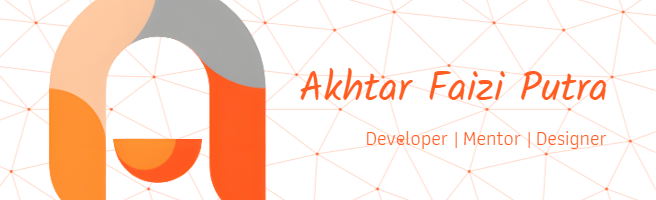

## Programming Language

## Frameworks And Library

## Connect With Me

   

## 📊 GitHub Stats:

 
 

## 🏆 GitHub Trophies

### 🔝 Top Contributed Repo

<h2 align="left">Play Game With Me</h2>

###

###
